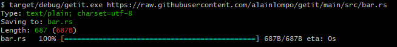

# getit
 A simple wget clone written with Rust (just for fun).orElse(...)

 ## Get the source
 You can get the source by cloning the repository, using for example
 ```git clone https://github.com/alainlompo/getit.git```

 ## Build from the source
 To build from the source run:

 ```cargo build```

 from the root directory of the project.

 ## Check that it is working
 Once your build is green, try it in order to ensure that everything is working fine.
 For example, on windows you can run (after building), using git bash:

 ```target/debug/getit.exe https://raw.githubusercontent.com/alainlompo/getit/main/src/bar.rs```

 The result should look like this:

 
